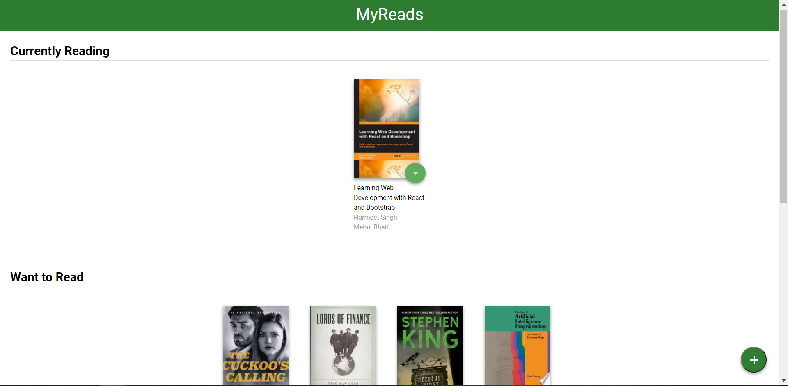
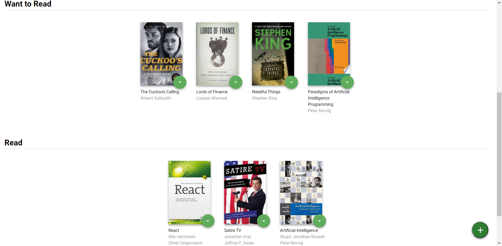
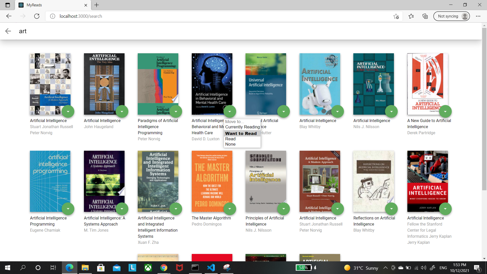
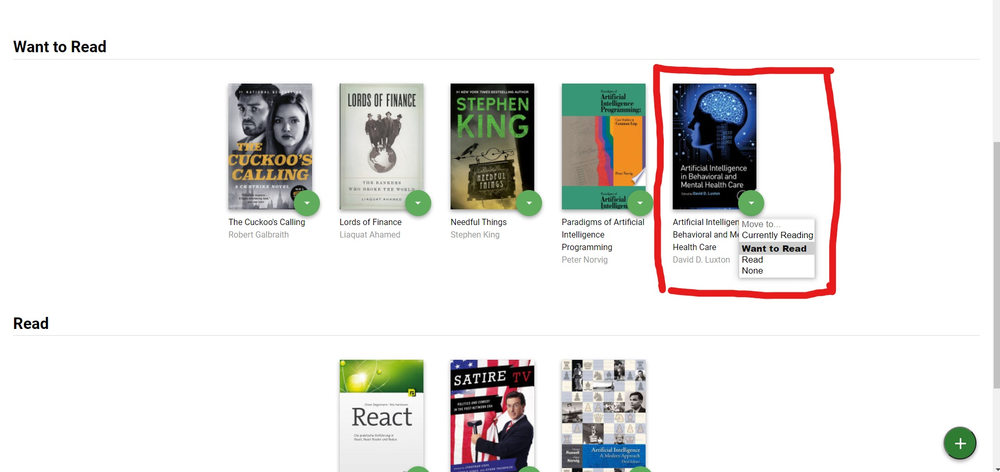

# MyReads Project To Track Your Books

This is a project for udacity's React Fundamentals course. The goal of this project
is to create a web application that can track your books and its status, you can search for books and add them to different categories, for example currently reading, read, or want to read, the main page shows the books you have in each shelf, you can update the book status and move it to s different shelf by the drop down menu on each book. 


## Installation

To run the application navigate to the project folder after cloning it and do the following:

* install all project dependencies with `npm install`
* start the development server with `npm start`

## Application Featres

* View your library and see what books you have in each shelf



* When you click on the add (+) buttonyou can search for new books and add them to your library


* You can see the book tou added when returning to the home page


## Backend Server

Udacity provides the baack end of the application. The provided file [`BooksAPI.js`](src/BooksAPI.js) contains the methods we  need to perform necessary operations on the backend:

* [`getAll`](#getall)
* [`update`](#update)
* [`search`](#search)

### `getAll`

Method Signature:

```js
getAll()
```

* Returns a Promise which resolves to a JSON object containing a collection of book objects.
* This collection represents the books currently in the bookshelves in your app.

### `update`

Method Signature:

```js
update(book, shelf)
```

* book: `<Object>` containing at minimum an `id` attribute
* shelf: `<String>` contains one of ["wantToRead", "currentlyReading", "read"]  
* Returns a Promise which resolves to a JSON object containing the response data of the POST request

### `search`

Method Signature:

```js
search(query)
```

* query: `<String>`
* Returns a Promise which resolves to a JSON object containing a collection of a maximum of 20 book objects.
* These books do not know which shelf they are on. They are raw results only. You'll need to make sure that books have the correct state while on the search page.

## Important
The backend API uses a fixed set of cached search results and is limited to a particular set of search terms, which can be found in [SEARCH_TERMS.md](SEARCH_TERMS.md). That list of terms are the _only_ terms that will work with the backend, so don't be surprised if your searches for Basket Weaving or Bubble Wrap don't come back with any results.


